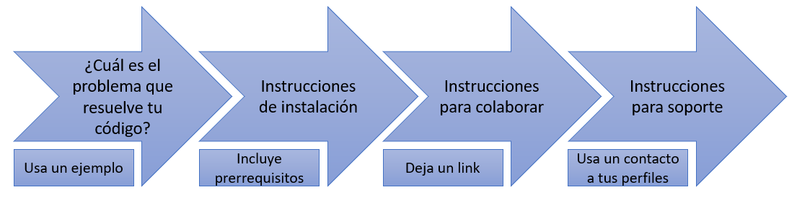

# Hackatón *Hello Mexicoders!*
# ¿Documentación? ¿Con qué se come?

A lo largo de nuestra carrera como programadores nos encontramos mucho con la palabra *documentación*, pero no tenemos muy claro que es, como funciona y porque es una parte tan importante de nuestro proyecto.

### ¿Qué es la documentación?
La documentación es un archivo que se adjunta a nuestros proyectos. En la actualidad podemos considerarlo una parte primordial del producto final de nuestro trabajo. Esto se debe a que sin el, no podemos usar de manera correcto los proyectos con los que trabajamos. 

Funciona como una bitácora en la que registramos el *¿por qué?* del código que estamos escribiendo y aquellas cosas que razonamos durante la creación del proyecto. Es como si hablaramos con nosotres mismes y tratáramos de explicarle a otros como funciona le código.

### ¿Por qué hacemos documentación?
De entrada podemos considerar la documentación una buena práctica, aunque esto también tiene sus razones. 

Hacemos documentación para nosotres mismes del futuro, de tal manera que si podemos leer la documentación del proyecto seis meses después de su realización y entender lo que hicimos, podemos pensar que es una buena documentación.

Hacemos documentación para otres de nuestro equipo o empresa que necesitan entender nuestro código, ya sea para trabajar sobre él o para mejorar las deficiencias que se vayan encontrando. 

Hacemos documentación incluso para aquellas personas externas que puedan encontrar nuestro código y darle otro uso.

### ¿Cómo hacemos documentación?
Te recomiendo que recopiles la información que vas a poner en tu documentación, esta puede ser en un archivo de texto plano o en cualquier otro formato que te resulte cómodo, siempre y cuando pueda mantenerse como parte del proyecto.

Las preguntas que debes de responder para lograr tu documentación son:
1. ¿Para qué sirve tu código?
2. ¿Cómo se usa tu código?
3. ¿Cómo se instala tu código?
4. ¿Cómo puede ayudarte alguien externo?
5. ¿Cómo pueden ponerse en contacto contigo?

### Partes de la documentación
Aunque hay muchas cosas que podemos poner en la documentación hay 4 partes principales que debes incluir.

 [^1] (Write the docs)

> **Nota:** Lo más recomendable es escribirlo en el orden que muestra el diagrama anterior, ya que resulta más fácil de leer para el usuario.

### Recomendaciones adicionales para tú código
1. Usa anclas en tu código
	- Le ayudará a las personas que lo lean y a ti a moverse más rápido en el código y sin perder información o tiempo.
2. Itera y separa las partes de tu código de manera correcta
	- Recuerda usar espaciados y tabulaciones para que tu código sea más fácil de leer

### Referencias
[^1]:  Write the docs, [*"A beginner’s guide to writing documentation"*](https://www.writethedocs.org/guide/writing/beginners-guide-to-docs/)

